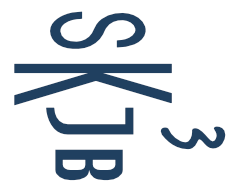

# Bootstrap KeystoneJS 3

A simple bootstrap for [KeystoneJS v3.x](https://github.com/keystonejs/keystone) 

 

 

### Roadmap

- Port to KeystoneJS v4 – [changes](https://github.com/keystonejs/keystone/wiki)
- Add thumbnail support in Media model
- Write comments for Handlebars helpers functions
- Dynamic routing
- Media and Gallery models refactoring and enhancing
- Better localization
- Test

#### Install

Install requirements:

	npm install
	bower install

Run Grunt:

	grunt --debug

### How to contribute

You can open issues to report bug, request features or send a Pull Request.

## License

[MIT](LICENSE)
